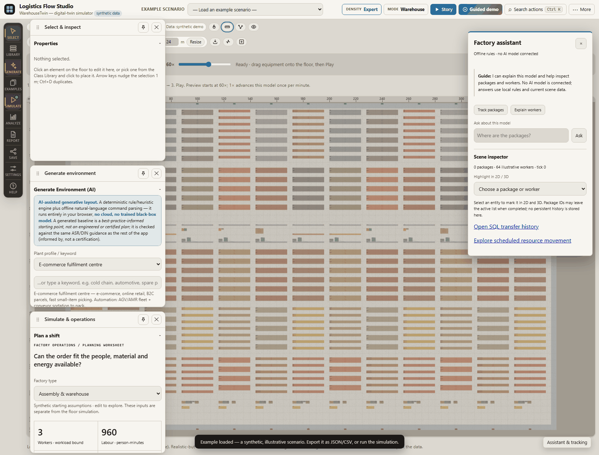
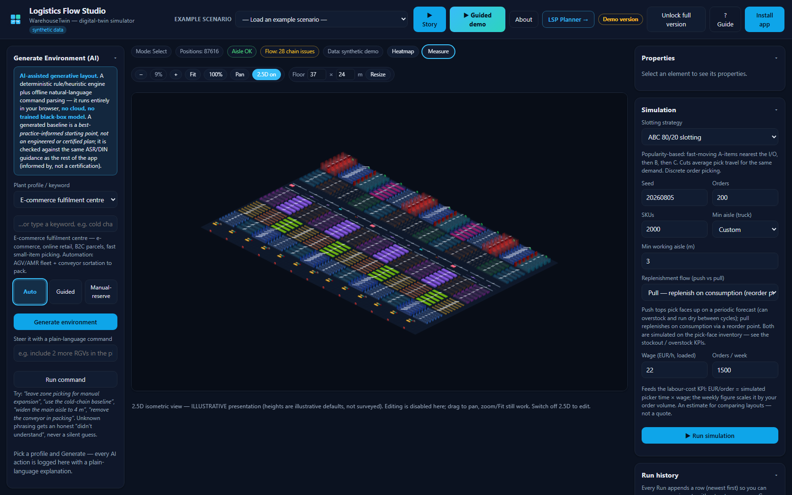
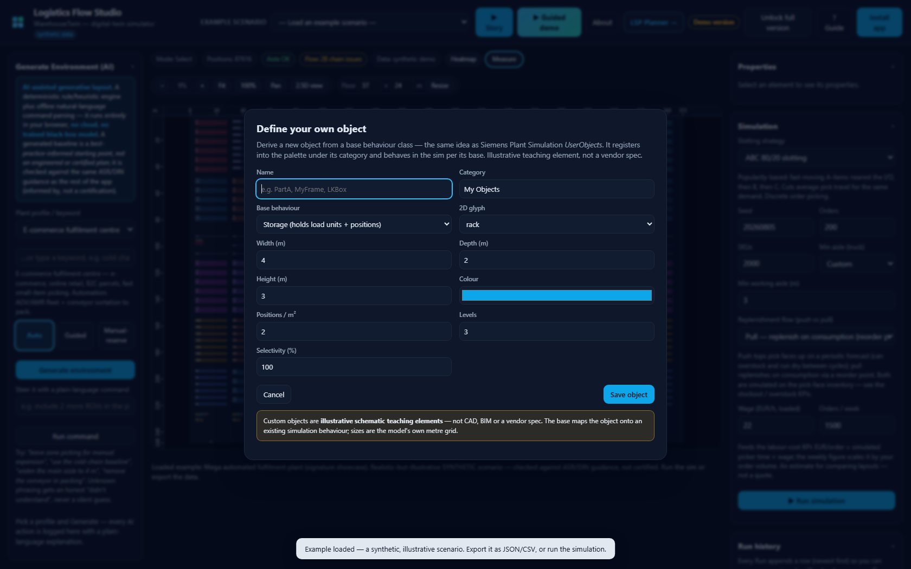
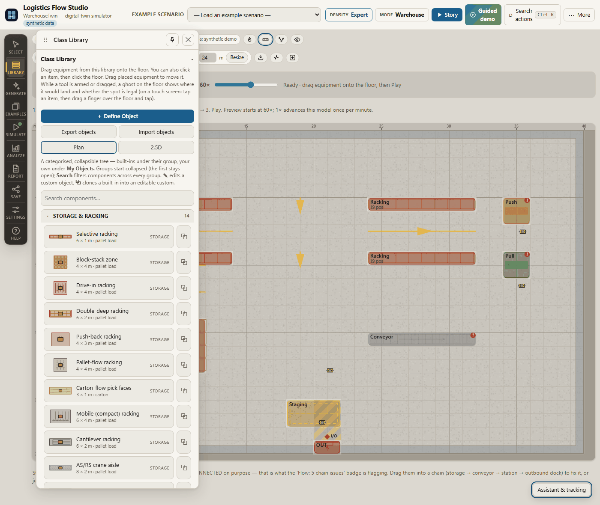

# WarehouseTwin — Logistics Flow Studio

> **An interactive, fully-offline warehouse & plant-flow simulator you operate right in your browser** — no install, no account, no server, no network calls.

[](https://dimitres-kisimov.github.io/logistics-flow-studio/)

- **What** — draw *or* generate a whole warehouse floor (racks, docks, staging, conveyor, automation), then run the material flow and the standard WMS operation as a living, animated plant-sim.
- **Why** — clarity over enterprise complexity: a transparent, game-like teaching twin that is standards-*informed* rather than a black-box tool.
- **Proof** — an **894-element signature plant**, a browser self-test **57/57**, **35 headless logic harnesses** all green, and a **100%-offline** installable PWA.

### ▶ Live app — <https://dimitres-kisimov.github.io/logistics-flow-studio/>

**Marquee capabilities**

- **▶ Story Mode** — a one-click **cinematic guided tour** that flies the camera zone-by-zone through the plant.
- **894-element signature plant** — a dense, fully-automated fulfilment plant (open it directly with `?scenario=mega-automated-fulfilment-plant`) carrying every one of the 29 object types, overlap-free and compliance-safe **by construction**.
- **User-definable object library** — define your **own** object types, *Siemens Plant Simulation UserObjects*–style: derive from a base behaviour class, give it a glyph, size and colour, and it joins the categorised palette **and** the simulation.
- **2D ⇄ 3D** — **press `P`** (or the "2.5D view" button) to flip the whole floor between the editable top-down plan and a 2.5D isometric presentation.
- **Animated material flow** — handling units, conveyors, RGV/AGV and AS/RS cranes move in **both** views, while a live KPI cockpit and a bounded order pool update from the same render loop.
- **ISO/DIN-informed compliance** — a deterministic pass/warn/fail design aid (working aisles, main traffic routes, escape routes) informed by ISO 22400 / DIN 15185 / ASR — *informed by, not a certification*.
- **Offline install** — a Progressive Web App that installs to the desktop and runs with **zero network calls**.

| 2.5D isometric presentation (press `P`) | Define your own object (UserObjects-style) |
| :--: | :--: |
| [](docs/img/hero-plant-iso.png) | [](docs/img/define-object.png) |

<sub><strong>Honest by design:</strong> the signature plant is built by a <strong>deterministic procedural generator</strong> (a seeded rule/heuristic engine), <em>not</em> a trained model; every figure is <strong>synthetic and illustrative</strong> unless you import your own data; the standards work is <strong>informed by public standards, not a certification</strong>; and there is <strong>no real company, brand or site</strong>.</sub>

---

WarehouseTwin is an **offline, browser-based warehouse / WMS digital twin and plant-flow simulator** that runs on a laptop with no install, no account and no server. Draw a warehouse floor plan — racks, dock doors, staging, conveyor, automation — or generate a whole layout from a plant profile, then simulate the material flow and the standard warehouse operation to see throughput, per-stage load, storage occupancy and where the bottleneck is. It is deliberately game-like and honest: every figure is **synthetic and seeded** (reproducible, same seed → same result) unless you import your own data, it is **informed by public standards** (ISO 22400, DIN 15185, ASR, EN, VDI) rather than being a certification, and it makes **zero network calls** — nothing is uploaded, and it installs as a Progressive Web App that works fully offline.



Single-page, no-build, no-framework — hand-written HTML, CSS and vanilla JavaScript on an HTML5 canvas.

## Features

### Design & generate
- **Interactive floor plan** on an HTML5 canvas: place selective racking, block-stack zones, VNA and pick-to-light racking, inbound/outbound docks, staging, conveyor and sorter loops, push/pull control stations, handling vehicles (forklift/reach truck, RGV/AGV) and support equipment (charging station, stretch-wrap/palletiser, returns/QA station, gate). Click to place, drag to move; everything snaps to a 1-metre grid, overlaps are blocked, and a minimum working-aisle rule (informed by DIN 15185) flags rack rows that sit too close.
- **AI Environment Generator** (`generate.js` + `nlcommands.js`): build a whole valid layout from a plant profile, then steer it with plain-language commands (e.g. *"include 2 more RGVs in the picking sector"*). A transparent, deterministic rule/heuristic engine with offline natural-language parsing — no cloud, no trained black-box model — and unknown phrasing gets an honest "didn't understand", never a silent guess.
- **23 example scenarios** (`examples.js`): preselected realistic-but-illustrative set-ups (automotive JIT, cold-chain, pharma GDP, AS/RS high-bay, 3PL cross-dock, …). Each is synthetic — no real company, brand or site — and loads onto the floor in one click.
- **Zoom, pan & configurable floor size** (`view.js`): scroll/keys to zoom (0.04×–8×), hand-drag to pan, Fit-to-view and 100% (1:1), and a resizable warehouse **up to 400 × 250 m** — big enough that the whole large hall frames with **Fit** (which zooms out far enough that the clamp no longer floors it) and zooms in for detail. Every draw and hit-test routes through one shared transform. Sizes are order-of-magnitude teaching values, not a site survey.
- **2.5D isometric view** (`iso.js`): a presentation-only toggle — **press `P`** (or the "2.5D view" button) to switch the whole view **2D ⇄ 3D** — that draws the floor as an extruded, depth-sorted isometric scene, reusing the same element heights the IFC export uses. The **live material flow and the animated equipment run in this view too** (see below), so it reads as a moving "plant-sim". Illustrative visualization — the accurate, editable source of truth stays the top-down plan. (`P` is input- and modifier-guarded; Pan keeps the Pan button, Space and middle-mouse drag.)
- **Distinct 2D + 3D object representations** (`shapes.js`): every warehouse object type has its **own recognizable schematic** rather than a coloured rectangle or a plain box. In the **top-down** view each type draws a distinct **glyph** — shelf-bay grids, deep-lane depth arrows, flow-lane chevrons, cantilever arms, an AS/RS crane-aisle hatch, shuttle channels, a mezzanine platform, dock-door notches, conveyor rollers, station workbenches, RGV/AGV vehicles, a block-stack pattern — and in the **2.5D** view a distinct **isometric form** — open, see-through rack frames (not solid blocks), a tall crane tower, a raised deck on legs, a low belt bed, bench furniture, floor vehicles, stacked cubes. One **single source of truth per type** (`WT.shapes`) feeds **both** renderers, with a **level-of-detail** path (a tinted footprint + a tiny icon when zoomed out) that keeps large layouts fast and legible, and the 3D forms reuse the **same element heights** the IFC export uses. Illustrative, recognizable schematics — **not** CAD/BIM geometry (the real BIM path is the IFC export).
- **29 placeable equipment types** — v1.9 adds **eight** more, each with its own glyph **and** isometric form: two storage systems — **pick-to-light rack** (light-directed pick faces) and **VNA narrow-aisle racking** (guided man-up turret; tall, dense, fully selective) — and six **0-capacity** handling/support/boundary elements — **forklift / reach truck**, **charging station**, **sorter loop (tilt-tray)** (a closed sortation loop, animated), **stretch-wrap / palletiser** (animated wrap arm), **returns / QA station**, and **gate / sectional door** (an internal zone barrier, distinct from a dock door). Additive and honest: the storage types carry pallet positions and form working aisles; the handling/support types hold **0** storage capacity like RGV/AGV, and every existing layout, example and generated plant still loads and renders unchanged.
- **Realistic high-detail rendering when you zoom in** (`shapes.js`, v1.11): a **third** level-of-detail tier — **`detailLevel(pxPerCell)` → icon → glyph → rich** — that only kicks in once an element reads large on screen. At the **rich** tier the racks fill with **pallet load-units**, AS/RS becomes a structured deep rack either side of the crane aisle, the mezzanine gets an interior post grid with pallets on the deck, docks get a panelled door, conveyors carry belt load-units, and forklift/RGV/AGV carry a load — in **both** the top-down and 2.5D views, layered on top of the base glyph so animated parts keep moving. The load-units are a **deterministic fill seeded from the element** (no `Date`, no random), so they're stable frame-to-frame; zoomed out, the app never reaches this tier (icon/glyph as before) and view-culling keeps big halls smooth. **Illustrative** higher-fidelity schematic — the pallets are a *"this bay holds stock"* read, **not** the actual computed inventory count, and still **not** CAD/BIM/survey geometry (the real geometry path is the IFC export).
- **Realistic floor — measurements, markings & a finer grid** (`floor.js`, v1.12): the *facility* reads like a real plant too, not just the objects. A **two-tier grid** (strong 5 m lines always, faint 1 m lines that appear only when you zoom in enough — a big hall zoomed out isn't a smear), a metre **scale ruler** along the top and left edges (ticks + labels whose spacing widens when zoomed out so they never collide), the **selected element's dimensions** (`w × d m`) shown beside it, and faint, theme-aware **floor markings** drawn *under* the elements: a facility **perimeter** outline, **aisle centre guides** between facing rack rows (reusing the *same* aisle model the Compliance Check uses, so they can't disagree), **dock-approach hatching** in front of the dock doors, and functional **zone tints** (receiving/storage/picking/packing/shipping) when the layout has those elements. A **Measure** toolbar toggle (default on) shows/hides the ruler, dimensions and markings; the grid tiers are always on and level-of-detail-gated so big maps stay smooth. **Rendering-only and additive** — the element data model is unchanged (positions/sizes stay integer-metre cells), so compliance, capacity and the simulation are untouched. **Illustrative** — the measurements are the model's own metre grid (1 cell = 1 m), **not** a site survey and **not** CAD/BIM (the real geometry path is the IFC export).

### Simulate & KPIs
- **Seeded, deterministic simulation** (`simulation.js`): builds a synthetic order stream, slots SKUs by Random or ABC 80/20, simulates picking over the floor you drew, and reports throughput (orders/hr), average pick travel (m/order), storage fill % and pallet positions used. Same seed → same result. A pick-travel **heatmap** overlay shows where the pickers walk, and a session-only **run history** table lets you compare experiments.
- **WMS Operations** (`wms.js`): the standard warehouse workflow — receiving → put-away → storage → replenishment → order-picking → packing → shipping — as a deterministic, seeded discrete flow over the current layout, with per-stage throughput derived from the layout and the bottleneck stage called out in plain language. KPIs mirror the ISO 22400 discipline.
- **Live material-flow animation** (`flowsim.js`): watch handling units move along the flow spine (receiving → storage → picking → packing → shipping) through the layout's zone centroids and any conveyor/RGV/AGV spine. **Material-flow realism** (`flowsim.js`) adds pick/put/pack stations as FIFO servers, conveyor-following routing and emergent queue congestion. The moving units **and** the station rings/queue badges render in **both** the top-down and the **2.5D** view (projected through the isometric projection). Deterministic, unit-conserving; a teaching animation, not a discrete-event-simulation engine.
- **Animated "living plant"** (`shapes.js`): while the flow is playing the **equipment moves**, not just the boxes — **conveyors** scroll unit-loads along the belt, **RGV/AGV** vehicles travel their lane, and **AS/RS**/**shuttle** carriages run the aisle and lift — in **both** the top-down and 2.5D views. The motion is a **deterministic phase seeded from the flow sim's tick** (`WT.shapes.equipmentPhase` — no `Date`/`Math.random`, one source of truth passed into `draw2D`/`draw3D`), so it is reproducible, **pauses with the sim** (Step/Pause = a static frame), is level-of-detail-aware, and honours `prefers-reduced-motion`. When the flow isn't running, equipment renders in its static form. Illustrative animation of a synthetic model — it changes no KPI, label or the flow model.
- **Live KPI dashboard** (`kpicharts.js`): a plant-sim "cockpit" strip — throughput over time, the seven-stage load-vs-capacity bars with the bottleneck flagged, and an in-flight vs shipped readout — updating in real time from the same render loop as the flow. Honest dataviz: 0-based bars, labelled scales, a colourblind-safe palette, light/dark themes.
- **Live order pool** (`orderpool.js`): the demand side made **visible and live** — orders are generated over time into a **bounded backlog** (a `SizeOrderPool`-style cap, mirroring the Siemens *generateOrders → order pool → selectOrders → consumed* spine), selected/released into the picking flow at the line rate and completed as the flow ships them. Driven from the **same render loop** as the animation, so its **selected** aligns with handling units entering picking and **completed** with units shipped. A compact readout shows pool backlog + fill bar, generated/selected/completed counts, live in/out rates, a backlog sparkline and an honest **starving / saturating** flag; overflow at the cap is counted as **dropped** (backpressure), never hidden. Count-conserving (`generated == inPool + inFlightSelected + completed + dropped`) and deterministic; generation reuses the SKU-velocity-weighted `wmsdata` generator when present. A transparent **bounded-queue heuristic**, not a real DES/queueing engine, not measured, not a certification.
- **Advisor, optimizer & A/B compare** (`advisor.js`, `optimizer.js`): a rule-based, explainable layout advisor; a golden-zone spatial optimizer that previews the change and its predicted KPIs before you apply it; and an A/B predictor that runs two configurations on the same seed and diffs the KPIs.

### Data & storage
- **SKU & order data layer** (`wmsdata.js`): a first-class SKU master + order pool the sim and WMS layer consume — generate a seeded synthetic catalogue (velocity & ABC from a transparent Pareto / 80-20 heuristic) or import your own article/order CSV. Export both.
- **Import your data** (`data.js`): run the sim on your own SKUs via an article CSV (`sku,description,weekly_picks[,class]`) and an optional order CSV (`order_id,sku,qty`), parsed in-browser with row-numbered validation. Your data stays on this device.
- **Floor-plan underlay**: trace a real hall — load a photo/plan under the grid, calibrate the scale with two points, then place racks over the traced plan. The image is local and never part of a share link.
- **Storage & inventory** (`storage.js`): derive physical storage locations from the racking, slot the SKU master into them by ABC / velocity (fast movers → golden zone), track occupancy and honest overflow, and expose a retrieval location the live material-flow leg uses.

### Standards & compliance
- **Compliance Check** (`compliance.js`): a deterministic pass/warn/fail review of the current layout — working aisles (informed by DIN 15185), main traffic routes (ASR A1.8), escape-route reachability/width (ASR A2.3), blocked-route detection — each finding showing the measured value, the informed-by guidance value and the offending element, with click-to-highlight. A design aid, **not** a certification, legal-compliance guarantee or *Gefährdungsbeurteilung*.
- **Editable standards knowledge base** (`knowledge.js`): the standards-derived parameters and thresholds the compliance check, advisor, generator and capacity model reason over, collected as one editable, versioned store. View, edit, add rules, reset, and import/export the whole KB as JSON — change a value and the engines use it on the next run. Values are informed by ISO / DIN / EN / VDI / ASR and remain yours to verify.

### Automation
- **Automation systems modeling** (`automation.js`): model the floor's AS/RS, shuttle, RGV, AGV and conveyor systems as explicit per-system throughput contributors with editable cycle-time parameters (KB `auto.*`, informed by VDI 4480 / VDI 2510) and utilisation vs the WMS flow demand, with an optional zoom/pan-safe utilisation overlay. With no automation elements the WMS result is unchanged. A transparent cycle-time heuristic — not measured, not a vendor spec, not a certification.

### Outputs
- **Consolidated WMS Report** (`report.js`): one printable/exportable report that aggregates every layer — layout, compliance, WMS ops KPIs, storage, automation, data profile and the standards basis — into a single stakeholder artifact. Every number is pulled from the owning module (never recomputed) so the report cannot drift from the app. Print (self-contained offline HTML), JSON and CSV.
- **Export to BIM (IFC)** (`ifc.js`): a dependency-free, scoped IFC4 (STEP) export — elements as proxy solids for coordination/viewing — generated locally and openable in free IFC viewers.
- **Save / load / share**: layouts persist in your browser and export/import as plain JSON. A **Share layout link** carries the whole design inside its `#layout=…` URL fragment (base64url JSON) — the link *is* the data; nothing is uploaded and no server is involved.
- **My scenarios** (`scenarios.js`): save the plants **you** build under a **name**, then reload, rename or delete them, and export/import a JSON backup bundle. Saved **only on this device** (browser `localStorage`, guarded so it degrades safely) — nothing is uploaded, and these are your own work, distinct from the read-only synthetic examples. Loading a scenario runs through the **same loader as JSON import**, and a saved scenario optionally carries your imported SKU/order data so the plant comes back with its data.
- **Scenario A/B compare** (`compare.js`): pick **two whole set-ups** — the current layout, a built-in example, or one of your saved scenarios — and see their key metrics **side-by-side with deltas** (absolute + % change B-vs-A) in a modal, answering *"which layout / strategy is better?"*. Each side's numbers are **derived from the same consolidated WMS Report** the app shows (`WT.report.build`, itself cross-consistent with the WMS/storage/automation/compliance modules), so the two sides **cannot drift** from the app. A plain-language *"what changed"* summary flags higher throughput, lower pick travel and better compliance; **"better/worse" colouring is applied only where the direction is unambiguous** (lower pick travel = better) while capacity, utilisation and automation stay **neutral** with an honest *"higher isn't always better"* note. Comparing runs on the picked snapshots and **never disturbs your current floor**. (Broader than the strategy-only *Compare A/B* predictor, which diffs two sim configs.)

### Demo
- **Guided demo + About** (`demo.js`): a one-click guided tour that sequences the existing features end-to-end — load a synthetic scenario → run WMS ops → play the material-flow animation → surface the live KPIs → offer the WMS Report — with an interruptible step HUD, plus a concise, honest "About / why this" panel. The demo re-implements nothing; it drives the same functions the manual controls call.

### Accessibility & performance
- **Accessibility** (real, but *not* a WCAG certification): the main regions are landmarked (`aria-label`ed), the `<canvas>` — opaque to screen readers — carries an `aria-label` **and** an `aria-describedby` offscreen summary that stays current with the layout (element count, floor size, view mode, sim status), the icon / short-text toolbar controls have accessible names, there's a visible `:focus-visible` outline on every control, and **`prefers-reduced-motion` is honoured** — the material-flow animation never auto-runs under it (a static/stepped frame instead), with the app staying fully usable.
- **Performance for large layouts** (bounded effort, *not* a guarantee for arbitrary size): the per-frame element draw is culled to what's on screen via the pure, testable `WT.view.cullToView`, and the per-type shapes registry drops to a single LOD icon when zoomed out. Rendering only — **simulation results are unchanged and deterministic**.

### Companion app
- **LSP Planner** (`lsp/`, linked from the header): a network-level logistics planning game — an abstract-region map editor, a deterministic cost/service evaluation engine, scored levels and A/B compare. Same offline, honest, teaching-scale philosophy.

## Using the app

The whole app is one screen: palette and generators on the left, the floor in the middle, properties and analysis on the right. The **side-panel cards are collapsible** — click a card's header (or press Enter/Space while it is focused) to fold that card away and keep long panels tidy; the collapsed state is remembered in your browser. Every card starts **expanded**, so first load looks and behaves exactly as before. A three-step onboarding card and tooltips on every palette item get a newcomer running in under a minute.

## Screenshots


The built-in **Cold-chain frozen DC** example scenario loaded onto the floor (opened directly via `index.html?scenario=coldchain-frozen-dc`). Each warehouse object draws as its own distinct 2D schematic glyph rather than a coloured rectangle. Like every example, it is **synthetic and illustrative** — no real company, brand or site — and the standards work is *informed by, not a certification*.

## Run it locally

It's static — no server or build step required.

- **Simplest:** open `index.html` in a modern browser. Everything works, including the canvas, the simulation and save/load.
- **As a full PWA (recommended):** service workers need `http(s)`, so serve the folder:
  ```
  python -m http.server 8000
  ```
  then visit `http://localhost:8000/`. It precaches itself, works offline, and the **Install app** button lights up when your browser offers installation.
- **Deep-links:** open a specific example scenario straight from the URL — append `?scenario=<id>` (or the alias `?example=<id>`, where `<id>` is a `WT.examples.library` id, e.g. `index.html?scenario=coldchain-frozen-dc`) and the app loads that synthetic plant onto the floor (via the *same* loader the UI buttons use) and shows it immediately, with the welcome modal suppressed for that load. So a scenario is **shareable/embeddable with a link**, and a demo or screenshot can open a chosen plant directly. Use `?onboarding=0` to skip the welcome modal without loading a scenario (a `?scenario=` implies it). An unknown id falls through to a normal boot with a gentle notice — a bad link never breaks the app, and none of this persists (it never flips your "don't show onboarding again" setting). The parsing is a small pure helper, `WT.deeplink.parse(search) → { scenario, skipOnboarding }` (`deeplink.js`), so it's headless-tested. `?tour=off` still skips the intro tour. Share links use the `#layout=…` fragment; **precedence** is: an explicit `#layout=` share-hash wins, else a `?scenario=`, else your saved layout, else the demo starter — and everything composes freely with `?selftest=1`.

Install-on-Android (PWA and the optional Play Store TWA wrap) is documented in [`PUBLISH_ANDROID.md`](PUBLISH_ANDROID.md).

## Honesty & standards

- **All data is synthetic and seeded** unless you import your own — there is no real inventory, order history or telemetry, and the example scenarios name no real company, brand or site. Nothing leaves your device: there are zero runtime network calls.
- **Informed by, not certified.** The aisle rule is *informed by* DIN 15185, the WMS/automation/KPI models are *informed by* ISO 22400 / VDI / EN, and the pallet sizes follow EPAL/UIC references — but WarehouseTwin performs **no compliance certification of any kind**. The Compliance Check, advisor and standards knowledge base are design aids; the figures shown are published guidance values, not legally binding limits, and a passing check does not mean a layout is compliant. Any value you edit is yours to justify.
- **Modelled, not measured.** The simulations are transparent teaching heuristics, not measurements of a real site and not a discrete-event-simulation engine. Model simplifications and their sources are written down in [`docs/DOMAIN_NOTES.md`](docs/DOMAIN_NOTES.md); the reproducible starter-layout figures are pinned in [`docs/MEASUREMENTS.md`](docs/MEASUREMENTS.md).
- **All assets are original or open.** Icons are hand-drawn SVG (rasterised with a small Python/Pillow script); there are no third-party logos, images or trademarks. See [`CREDITS.md`](CREDITS.md).
- **No superlatives.** It's a teaching twin, not a WMS — no "best/certified/guaranteed" claims, and the UI names no specific commercial product.

## Verification

Every documented behaviour is backed by a headless harness (no stubs). Run them all:

```
node test/run-all.mjs
```

**35 harnesses** cover the simulation baselines, the share-link codec, CSV import, IFC export, the Compliance Check, the generator, the example library, the WMS/automation/flow/KPI/storage/report layers, the standards knowledge base, the guided-demo plan, the collapsible-cards helper, the saved-scenarios store, the Scenario A/B compare (with cross-consistency assertions proving a compared side equals the report/WMS/storage/automation/compliance modules), the live order pool (determinism, count conservation, the cap + honest overflow, the starving/saturating flags and the selection-rate tie to the WMS/flow throughput), the per-type 2D + 3D shape registry (a mock-context smoke test drawing every object type in both 2D and 3D, in light and dark, at small and large scale, asserting no non-finite coordinate and no throw — the practical way to verify a pure-draw feature that can't be pixel-tested headlessly — plus exact domain-type coverage and the height-driven 3D forms), the production hardening (the global error boundary installs and records without swallowing, the strict offline Content-Security-Policy meta is present with no `unsafe-eval`, no `eval(`/inline handlers anywhere, and the in-browser self-test is inert without its flag yet carries ≥ 25 wiring assertions), the accessibility + large-layout performance pass (the `#floor` canvas has an aria-label + an offscreen `aria-describedby` summary, the named toolbar controls have accessible names, a `prefers-reduced-motion` rule exists and the flow loop reads the flag so the animation never auto-runs under it, a `:focus-visible` outline + an `.sr-only` helper are present, and the pure `WT.view.cullToView` render-culling helper drops fully-off-screen elements, keeps inside/overlapping ones, never mutates its input and is deterministic), the scenario deep-link parser (the pure, DOM-free `WT.deeplink.parse` returns the id for `?scenario=<id>` and `?example=<id>` with onboarding suppressed, `?onboarding=0` suppresses the modal on its own, an empty query and `?selftest=1` are a clean no-op, an unknown id is returned raw for the app to validate, a real library id round-trips, and it reads no DOM, mutates nothing and is deterministic), the living-plant animation (`equipmentPhase` bounded in `[0,1)`/deterministic/periodic; a mock-context smoke drawing every animatable type in 2D and 3D across phases + themes with no throw and all-finite coords; a distinct phase visibly moving the part while a non-animatable type ignores it and the static path stays byte-identical; the 2D animation LOD-skipped when tiny; no input mutation; `WT.iso.project` mapping an MU position to finite coords; and the shipped wiring — the `p`/`P` keydown → view toggle input- + modifier-guarded, flow-in-3D via `projPx`, the tick-seeded/playing-gated anim threaded into `draw2D` + `drawScene`), the realistic-floor rendering geometry (the pure, DOM-free `WT.floor` helpers: `rulerTicks` returning correct/ordered/labelled metre ticks that close on the true floor edge; the grid tiers + minor-grid LOD threshold; `dimensionLabel` giving the right `w × d m` text; `perimeter`, `dockApproach` and `aisleGuides` returning finite, in-bounds geometry without mutating their inputs; `zoneTints` yielding tints only when zone-bearing elements exist; the honesty label; and the shipped wiring — `floor.js` loaded + precached at `wt-v41`, the `measureBtn` toggle present and wired), and an offline guard that asserts the app references no external assets. Everything is deterministic and ASCII-only; exit code 0 means all green.

### In-browser self-test

The 35 harnesses above cover the **pure logic** in Node. The **DOM/UI** is covered by a **real in-browser end-to-end self-test** that drives the live app through the same handlers the UI uses. Serve the app over `http(s)`/localhost, then open:

```
index.html?selftest=1
```

After boot it runs ~57 checks against the live app (every `WT.*` module present and correctly shaped, a clean error-free boot, the scenario deep-link parser returning a real library id with onboarding suppressed, the key panels/buttons in the DOM, loading an example, running WMS ops, stepping/playing the flow, the 2.5D toggle being a layout no-op, **a real `KeyboardEvent` for `P` toggling the view mode `top → iso → top`**, building the report, opening About/KB, the zoom controls, plus the v1.6 a11y/perf checks — canvas aria-label + offscreen summary, toolbar accessible names, the reduced-motion flag, and the pure `cullToView` culling) and writes a machine-readable line into the `#wt-selftest` element and the console:

```
WT-SELFTEST: PASS 57/57
WT-SELFTEST: FAIL 44/57 :: <failed check names>
```

A normal load (no flag) is completely unaffected — the self-test code is inert. This verifies **wiring and a no-uncaught-error boot**, not visual/pixel correctness. See [`docs/PRODUCTION.md`](docs/PRODUCTION.md) and the maintainer's [`docs/QA_CHECKLIST.md`](docs/QA_CHECKLIST.md).

## Licence

© 2026 Dimitres Kisimov — all rights reserved. Published for portfolio review and evaluation only; no permission is granted to use, copy, modify or distribute. See [`LICENSE`](LICENSE).
