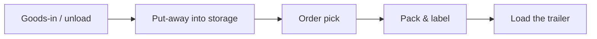
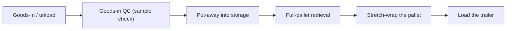
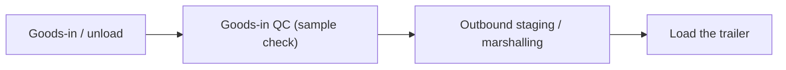
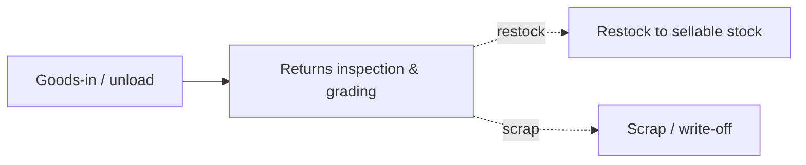
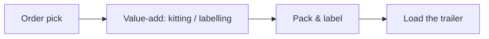
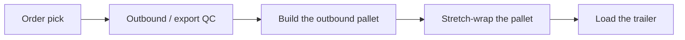
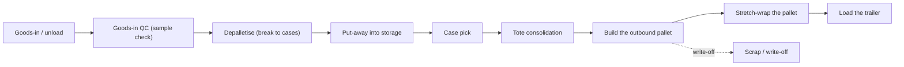

# The route graph (v3.68)

*Generated by `node tools/route_graph.mjs --out docs/ROUTE_GRAPH.md`. Do not edit by hand: the graphs are read out of `routing.js`, and `--check` fails if this page has drifted from the code.*

Until v3.68 a route was a **list** of operations. Four of the limits this app documents about itself ended with the same sentence - *cycles need a graph* - because a list cannot say "do that step again". A rework had to be written out flat: the operation, its check, the operation once more. A unit that erred twice could not be expressed at all.

A route is now a directed graph, and the list is what you get by **walking** it. Nothing a caller sees changed when this landed: every route, every run id and every committed fixture is byte for byte what it was, and `verify_routegraph.js` pins each list against the one v3.67 produced. What changed is what the model can say.

## The edge kinds

| Kind | Drawn | Meaning |
|---|---|---|
| `then` | plain | the ordinary sequence: the next step of the recipe |
| `outcome` | dotted | a declared split - the route takes one outcome and not the others |
| `check` | thick | a verification step, entered only when a declared error was realised at this step |
| `rework` | thick, labelled REWORK | a BACK EDGE - the step is done again after its check, bounded by the target's maxVisits |
| `write-off` | dotted | a terminal edge - the unit leaves the route at a write-off bench |

A node drawn with rounded ends is one a unit may visit **more than once**. That is the cycle, and it is bounded: `maxVisits` is 2 in this release, which is one redo - exactly the detour the flat list used to spell out.

## The eight order types

### Standard flow spine (legacy default)

The single hardcoded path every unit walked before v3.25: in at the dock, away to storage, picked, packed, shipped. Kept as the DEFAULT so a caller that declares no order mix gets byte-identical v3.24 behaviour.



Walk: receive → putaway → pick → pack → load

### Full pallet out (no touch)

A whole pallet in, a whole pallet out. It is sample-checked on arrival, put away, retrieved intact, stretch-wrapped and loaded. It is NEVER depalletised and NEVER packed - the two operations the old spine forced on every unit.



Walk: receive → qc-sample → putaway → pallet-pick → wrap → load

### Case pick (carton out)

Retail replenishment. The inbound pallet is broken to cases, cases are put away, picked whole, consolidated, built into a dispatch pallet and secured. Note it is NOT re-packed: full cases usually ship as they are, which is why this route ends in palletise + stretch-wrap rather than at a pack bench.

```mermaid
flowchart LR
  receive["Goods-in / unload"]
  qc_sample["Goods-in QC (sample check)"]
  depalletise["Depalletise (break to cases)"]
  putaway["Put-away into storage"]
  case_pick["Case pick"]
  consolidate["Tote consolidation"]
  palletise["Build the outbound pallet"]
  wrap["Stretch-wrap the pallet"]
  load["Load the trailer"]
  receive --> qc_sample
  qc_sample --> depalletise
  depalletise --> putaway
  putaway --> case_pick
  case_pick --> consolidate
  consolidate --> palletise
  palletise --> wrap
  wrap --> load
```



Walk: receive → qc-sample → depalletise → putaway → case-pick → consolidate → palletise → wrap → load

### Each / piece pick (e-commerce)

The longest route in the building: depalletise, put away to reserve, replenish the forward face, pick eaches into a tote, consolidate the order, pack it and load it. Eight touches, not five.

```mermaid
flowchart LR
  receive["Goods-in / unload"]
  depalletise["Depalletise (break to cases)"]
  putaway["Put-away into storage"]
  replen["Replenish the pick face"]
  piece_pick["Piece / each pick"]
  consolidate["Tote consolidation"]
  pack["Pack & label"]
  load["Load the trailer"]
  receive --> depalletise
  depalletise --> putaway
  putaway --> replen
  replen --> piece_pick
  piece_pick --> consolidate
  consolidate --> pack
  pack --> load
```



Walk: receive → depalletise → putaway → replen → piece-pick → consolidate → pack → load

### Cross-dock (never enters storage)

Straight across the building. Checked at goods-in, marshalled on the outbound floor and loaded. It NEVER enters the racking - the defining property the old single spine could not express. This is the SINGLE-STAGE form, where the supplier has already picked for the recipient and the load unit is never broken; the two-stage (break-and-re-form) variant needs the consolidation and de-consolidation stations R2 adds.



Walk: receive → qc-sample → stage-out → load

### Customer returns (restock or scrap)

Counter-flow. A return comes IN through the dock, is inspected and graded, and then takes one of TWO outcomes: back into sellable stock, or written off at the bench. A real routing split, not a label.



Walks:

- **graded good - back to stock** (declared share 0.75): receive → inspect → restock
- **failed grading - written off** (declared share 0.25): receive → inspect → scrap

### Value-add services (kitting / labelling)

Work on stock that is ALREADY in the building: pick it, kit or re-label it, pack it, load it. It starts at the pick face, not at the dock.



Walk: pick → vas → pack → load

### Export / fragile (extra QC + palletise + wrap)

Stock already held is picked, checked a second time, built into a dispatch pallet, stretch-wrapped and loaded. Extra assurance, extra handling.



Walk: pick → qc-final → palletise → wrap → load

## An error branch, which is where the loop is

The error what-if of v3.54 adds edges rather than a second recipe. A mis-pick at the each-pick face puts a **check** edge into the verification step and a **rework** edge straight back to the pick:

```mermaid
flowchart LR
  receive["Goods-in / unload"]
  depalletise["Depalletise (break to cases)"]
  putaway["Put-away into storage"]
  replen["Replenish the pick face"]
  piece_pick(["Piece / each pick (up to 2 visits)"])
  consolidate["Tote consolidation"]
  pack["Pack & label"]
  load["Load the trailer"]
  verify_pick["Pick verification (scan check at the face)"]
  receive --> depalletise
  depalletise --> putaway
  putaway --> replen
  replen --> piece_pick
  piece_pick --> consolidate
  consolidate --> pack
  pack --> load
  piece_pick ==>|check| verify_pick
  verify_pick ==>|REWORK| piece_pick
  verify_pick --> consolidate
```



- Without the error realised, the walk is: receive → depalletise → putaway → replen → piece-pick → consolidate → pack → load
- With it: **receive → depalletise → putaway → replen → piece-pick → verify-pick → piece-pick → consolidate → pack → load**

Handling damage is the other shape: a terminal **write-off** edge that takes the unit off the route at the bench.



Walk with the damage realised: **receive → qc-sample → depalletise → putaway → case-pick → consolidate → palletise → scrap**

## What is still a limit

The refactor did not quietly close anything it did not close.

- **A unit that errs twice is still not modelled**, and the graph now says precisely why - which the flat list could not. Raising a node's `maxVisits` from 2 to 3 changes nothing on its own: the **check** edge is entered only on the *first* visit to a step, so a unit that has been reworked once is never offered a second verification. A second error is a second draw from the quota dispatcher, not a second lap of the loop. The visit bound is a guard rail, not the model.
- **Quality control is still a pass-through node** with one ordinary edge out. The graph can hold the branch to blocked stock, where a unit dwells until it is released. Nothing declares it yet.
- **Replenishment is still a node in the each-pick chain**, not the order-independent loop it is in a real building. The same is true of re-slotting.
- **The order of the recipe is still fixed.** VDI 3590 says the sequence is not necessarily determined and that steps may be omitted; the graph can express an optional step or an alternative path, and no archetype declares one yet.
- **The walk takes no random draw.** Which branch a unit takes is decided by the quota dispatcher, exactly as before.

## Honesty

> A declared route graph, not an observed one: the nodes are this app's teaching operations and the edges are the recipe's own order, informed by ordinary distribution-centre practice (VDI 4490's process decomposition, VDI 3590's unit-transformation chain) and by nothing measured in any plant. The walk is deterministic and takes no random draw. A rework is a bounded back edge - one redo in this release - and a unit that errs twice is still not modelled. A node is a process step and never a person, and nothing here is keyed to one (BetrVG 87(1)6, GDPR Art. 88).

## Reproduce

```sh
node tools/route_graph.mjs --check
node verify_routegraph.js
```
